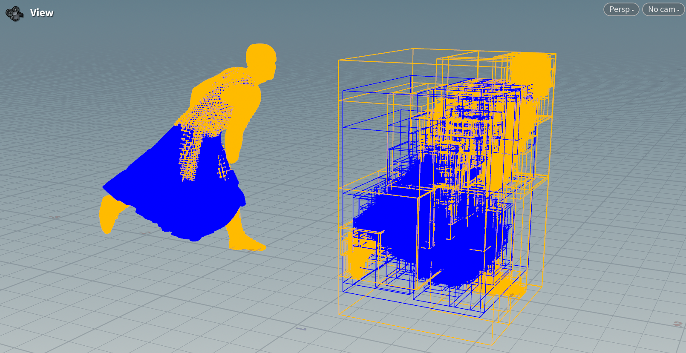

# culbvh
lbvh implementation and benchmark following jerry's (https://github.com/jerry060599/KittenGpuLBVH) optimization. I refactor it using `float3` as basic vector type instead of the dependence on glm. Experiment show neligible difference on such two implements.

## Deps
Depends on TBB. You should install it and configure the proper enviorment variables to let CMake find it. Installing through vcpkg is also verified, but will take a bit long time.
## Dataset
I provided part of the asset generated from real simulation scene to benchmark the common simulation results. The aabb is following the format:

```
min.x
min.y
min.z
max.x
max.y
max.z
```
where each line is a float number.

If you want to visualize the bvh, please use the tool I provided on `tool`. `visualize_aabb` will generate a wireframe sets in format OBJ represent the aabb set, `visualize_bvh` will generate a wireframe sets in format OBJ represent the bvh. Just edit the `config.json` with the case name (`${DATASET_NAME}/xxx.bin`). See default example. It will output the file to `asset/out/xxx.obj`


## Statistics
To run the time statictics on the whole dataset, see `test_simulation_dataset.cu` and run `lbvh_test_simulation_dataset`. The test will take about 5-10 min to finish and will output the result to `asset/statistic`.
Noticed: the timing on `build` counting all the time, including the allocation of memory. The timing on `query` do not count the allocation of memory.

## TODO
 - stackless bvh and benchmark
  
    I first heard this algorithm when I am an intern at Style3D reasearch. Not even try yet.