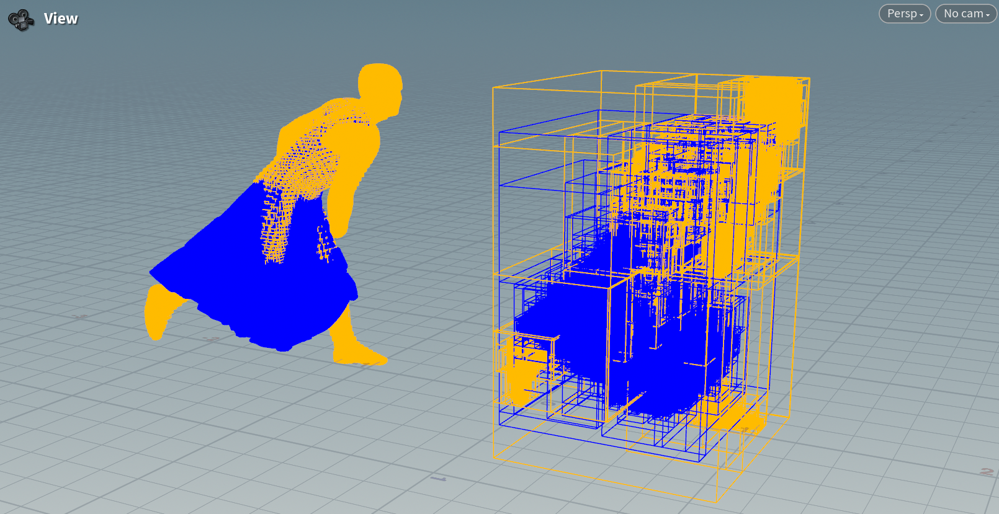

## :tada: Update (2025/11/29)
I add up a new stackless bvh tutorial version (for bvh-aabb query) to demonstrate the parallel building-up on escape index and single-pass (still inspired by jerry) stackless tranverse algorithm, which is more human-readable. The tree structure is following original lbvh's morton code order (without query-based reordering, which should be faster). See stacklessbvh_lite. 

Can pass all simulation dataset's GT.

Next's optimization: 
 - replace the thrust's parallel primitive by cub
 - optimized the buffer managment (through benchmark, the buffer allocation is always the bottleneck)
 - query-based reordering (make the 2n-1's node ordered as bfs-threaded order to allow maximized memory coalescing). See [Wang, 18](https://min-tang.github.io/home/BVH-OR/)
 - bvh-bvh stackless algorithm (less universality but should be faster for narrow case (all the aabb list required prebuild bvh)).

## :tada: Update
A stackless bvh implemented by [@caixiao-0725](https://github.com/caixiao-0725), thanks xiao!


# culbvh
lbvh implementation and benchmark following Jerry's [@jerry060599](https://github.com/jerry060599) (https://github.com/jerry060599/KittenGpuLBVH) optimization. I refactored it using `float3` as a basic vector type instead of the dependence on glm. Experiments show a negligible difference between these two implementations.

## Deps
Depends on TBB. You should install it and configure the proper environment variables to let CMake find it. Installing through vcpkg is also verified, but will take a bit long time.
## Dataset
I provided part of the contact aabb as an asset generated from real large-scale simulation cases to benchmark the practical simulation results on the broadphase. The aabb assets are following the format:

```
min.x
min.y
min.z
max.x
max.y
max.z
```
where each line is a float number.

If you want to visualize the bvh, please use the tool I provided on `tool`. `visualize_aabb` will generate a wireframe set in format OBJ representing the aabb set, `visualize_bvh` will generate a wireframe set in format OBJ representing the bvh. Just edit the `config.json` with the case name (`${DATASET_NAME}/xxx.bin`). See the default example. It will output the file to `asset/out/xxx.obj`


## Statistics
To run the time statistics on the whole dataset, see `test_simulation_dataset.cu` and run `lbvh_test_simulation_dataset`. The test will take about 5-10 minutes to finish and will output the result to `asset/statistic`.
Noticed: the timing on `build` counts all the time, including the allocation of memory. The timing of `query` does not count the allocation of memory.

## TODO
 - ~~stackless bvh and benchmark~~
  
    I first heard this algorithm when I was an intern at Style3D research. Not even tried yet.
